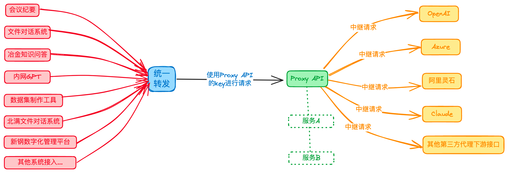

# 转发API (AI接口服务中间件)
> 打造统一的AI接口服务中间件, 通过统一的接口, 转发到各个AI接口服务, 从而实现统一管理, 降低接口适配成本.

> 接口全部统一继承使用OpenAI的接口规范, 以便于后续模型的迁移, **但返回参数需要根据各个接口服务的返回参数进行适配.**

> 此服务中间件仅做转发,不做计费处理.

## 项目初始化
- 安装依赖
```bash
pip install -r requirements.txt
```

- 初始化数据库
`data/init.sql` 文件为数据库初始化文件,请自行导入数据库

- 添加一个新账号作为后台管理账号. 先注册一个账号 (访问`http://[前端地址]/register`), 然后在数据库中修改该账号的`status`字段为1, 即可作为后台管理账号登录.

## 渠道类型说明
- 1: 原生OpenAI
- 2: OhMyGPT
- 3: 所有One-API程序转发的接口
- 4: OpenSB
- 5: 阿里灵石Qwen系列 (模型名称传: `qwen-7b-chat`,`qwen-14b-chat`,`qwen-plus`,`qwen-turbo`)

## 项目架构
 

### 适配进度
- [x] `OpenAI`Chat接口
- [x] `OpenAI`Embedding接口
- [x] `OpenAI`Images接口
- [x] `OpenAI`Audio接口
- [x] `OpenAI`TTS接口
- [ ] `OpenAI`工具/插件
- [x] `OpenAI`Assistants接口(待测试)
- [ ] `Discord`MidJourney绘图接口
- [ ] `Anthropic`Claude2接口
- [x] `阿里灵石`Qwen系列接口(qwen-7b/14b/plus/turbo)
- [x] `本地模型`ChatGLM3接口(待开放外网访问权限)
- [ ] `ZhiPu.AI`Chat接口
- [ ] `ZhiPu.AI`Embedding接口

## 项目截图
  
   
  

## 接口文档
- [查看接口文档](https://apifox.com/apidoc/shared-2c467c83-554d-4a60-b640-edbcc877f383)